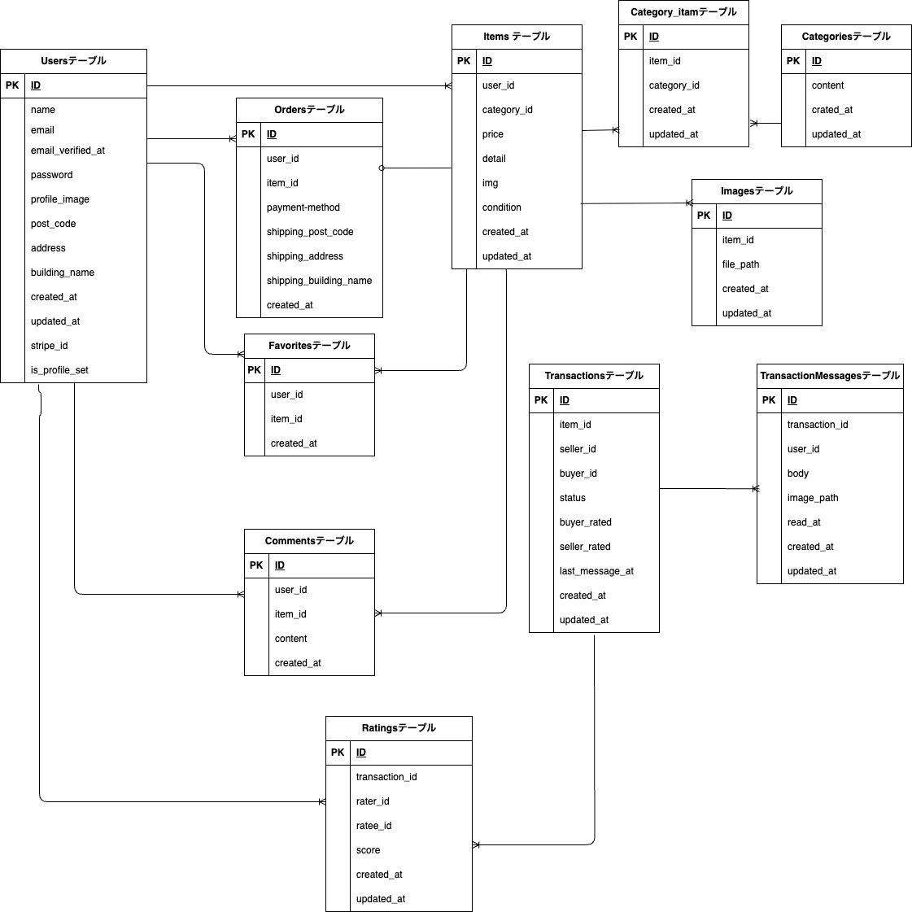

# アプリケーション名
「coachtech フリマアプリ」

## 環境構築

Docker ビルド  
1. `git clone git@github.com:kazyuaki/flea-market-app.git`  
2. `docker-compose up -d --build`

Lavaral 環境構築  
1. `docker-compose exec php bash`
2. `composer install`
3. `cp .env.example .env`  
4. `.env ファイルの変更`

```
　DB_HOSTをmysqlに変更
　DB_DATABASEをlaravel_dbに変更
　DB_USERNAMEをlaravel_userに変更
　DB_PASSをlaravel_passに変更
　MAIL_FROM_ADDRESSに送信元アドレスを設定
  例） no-reply@example.com
```

5. `php artisan key:generate  `
6. `php artisan migrate`  
   　※ 数秒待ってから migrate してください
7. `php artisan db:seed`  <br>
8. `php artisan storage:link`
9.  `php artisan test`

#### メール認証(Mailhog)

1. .env のメール設定
```
MAIL_MAILER=smtp
MAIL_HOST=mailhog
MAIL_PORT=1025
MAIL_USERNAME=null
MAIL_PASSWORD=null
MAIL_ENCRYPTION=null
MAIL_FROM_ADDRESS=null
MAIL_FROM_NAME="${APP_NAME}"
```
2. 会員登録後のメール認証画面から 認証メールを送信


3. Mailhog サーバー上で 届いたメールを認証する
- サーバーURL：http://localhost:8025

#### 決済(Stripe)
1. Stripeにサインイン
- 決済(Stripe): https://stripe.com/jp

1. 「開発者タブ」→ APIキーから公開可能キーとシークレットキーを取得
   
2. `.env` に設定
    ```
    STRIPE_KEY="パブリックキー"
    STRIPE_SECRET="シークレットキー"
    ```

以下のリンクは公式ドキュメントです。<br>
https://docs.stripe.com/payments/checkout?locale=ja-JP

## 使用技術(実行環境)
- 言語
  - PHP 8.2
  - JavaScript (ES6)

- フレームワーク
  - Laravel 8.x
- サーバー環境
  - MySQL 8.4.4
  - nginx 1.21.1

## テーブル仕様

### usersテーブル
| カラム名      | 型           | primary key | unique key | not null | foreign key |
| ------------- | ------------ | ----------- | ---------- | -------- | ----------- |
| id            | bigint       | ◯           |            | ◯        |             |
| name          | varchar(255) |             |            | ◯        |             |
| post_code     | varchar(255) |             |            |          |             |
| address       | varchar(255) |             |            |          |             |
| building_name | varchar(255) |             |            |          |             |
| created_at    | timestamp    |             |            |          |             |
| updated_at    | timestamp    |             |            |          |             |

---

### itemsテーブル
| カラム名    | 型           | primary key | unique key | not null | foreign key    |
| ----------- | ------------ | ----------- | ---------- | -------- | -------------- |
| id          | bigint       | ◯           |            | ◯        |                |
| user_id     | bigint       |             |            | ◯        | users(id)      |
| category_id | bigint       |             |            | ◯        | categories(id) |
| price       | int          |             |            | ◯        |                |
| detail      | varchar(255) |             |            | ◯        |                |
| img         | varchar(255) |             |            |          |                |
| condition   | varchar(255) |             |            |          |                |
| created_at  | timestamp    |             |            |          |                |
| updated_at  | timestamp    |             |            |          |                |

---

### categoriesテーブル
| カラム名   | 型           | primary key | unique key | not null | foreign key |
| ---------- | ------------ | ----------- | ---------- | -------- | ----------- |
| id         | bigint       | ◯           |            | ◯        |             |
| content    | varchar(255) |             |            | ◯        |             |
| created_at | timestamp    |             |            |          |             |
| updated_at | timestamp    |             |            |          |             |

---

### category_itemテーブル
| カラム名    | 型        | primary key | unique key                   | not null | foreign key    |
| ----------- | --------- | ----------- | ---------------------------- | -------- | -------------- |
| item_id     | bigint    |             | ◯(category_idとの組み合わせ) | ◯        | items(id)      |
| category_id | bigint    |             | ◯(item_idとの組み合わせ)     | ◯        | categories(id) |
| created_at  | timestamp |             |                              |          |                |
| updated_at  | timestamp |             |                              |          |                |

---

### imagesテーブル
| カラム名   | 型           | primary key | unique key | not null | foreign key |
| ---------- | ------------ | ----------- | ---------- | -------- | ----------- |
| id         | bigint       | ◯           |            | ◯        |             |
| item_id    | bigint       |             |            | ◯        | items(id)   |
| file_path  | varchar(255) |             |            | ◯        |             |
| created_at | timestamp    |             |            |          |             |
| updated_at | timestamp    |             |            |          |             |

---

### favoritesテーブル
| カラム名   | 型        | primary key | unique key                   | not null | foreign key |
| ---------- | --------- | ----------- | ---------------------------- | -------- | ----------- |
| id         | bigint    | ◯           |                              | ◯        |             |
| user_id    | bigint    |             |                              | ◯        | users(id)   |
| item_id    | bigint    |             | ◯(user_idとの組み合わせ推奨) | ◯        | items(id)   |
| created_at | timestamp |             |                              |          |             |
| updated_at | timestamp |             |                              |          |             |

---

### commentsテーブル
| カラム名   | 型           | primary key | unique key | not null | foreign key |
| ---------- | ------------ | ----------- | ---------- | -------- | ----------- |
| id         | bigint       | ◯           |            | ◯        |             |
| user_id    | bigint       |             |            | ◯        | users(id)   |
| item_id    | bigint       |             |            | ◯        | items(id)   |
| content    | varchar(255) |             |            | ◯        |             |
| created_at | timestamp    |             |            |          |             |
| updated_at | timestamp    |             |            |          |             |

---

### ordersテーブル
| カラム名               | 型           | primary key | unique key | not null | foreign key |
| ---------------------- | ------------ | ----------- | ---------- | -------- | ----------- |
| id                     | bigint       | ◯           |            | ◯        |             |
| user_id                | bigint       |             |            | ◯        | users(id)   |
| item_id                | bigint       |             | ◯          | ◯        | items(id)   |
| payment_method         | varchar(50)  |             |            | ◯        |             |
| shipping_post_code     | varchar(255) |             |            | ◯        |             |
| shipping_address       | varchar(255) |             |            | ◯        |             |
| shipping_building_name | varchar(255) |             |            |          |             |
| created_at             | timestamp    |             |            |          |             |
| updated_at             | timestamp    |             |            |          |             |

---

### transactionsテーブル
| カラム名        | 型           | primary key | unique key | not null | foreign key |
| --------------- | ------------ | ----------- | ---------- | -------- | ----------- |
| id              | bigint       | ◯           |            | ◯        |             |
| item_id         | bigint       |             |            | ◯        | items(id)   |
| seller_id       | bigint       |             |            | ◯        | users(id)   |
| buyer_id        | bigint       |             |            | ◯        | users(id)   |
| status          | varchar(255) |             |            | ◯        |             |
| buyer_rated     | tinyint(1)   |             |            | ◯        |             |
| seller_rated    | tinyint(1)   |             |            | ◯        |             |
| last_message_at | timestamp    |             |            |          |             |
| created_at      | timestamp    |             |            |          |             |
| updated_at      | timestamp    |             |            |          |             |

---

### transaction_messagesテーブル
| カラム名       | 型           | primary key | unique key | not null | foreign key      |
| -------------- | ------------ | ----------- | ---------- | -------- | ---------------- |
| id             | bigint       | ◯           |            | ◯        |                  |
| transaction_id | bigint       |             |            | ◯        | transactions(id) |
| user_id        | bigint       |             |            | ◯        | users(id)        |
| body           | text         |             |            |          |                  |
| image_path     | varchar(255) |             |            |          |                  |
| read_at        | timestamp    |             |            |          |                  |
| created_at     | timestamp    |             |            |          |                  |
| updated_at     | timestamp    |             |            |          |                  |

---

### ratingsテーブル
| カラム名       | 型        | primary key | unique key | not null | foreign key      |
| -------------- | --------- | ----------- | ---------- | -------- | ---------------- |
| id             | bigint    | ◯           |            | ◯        |                  |
| transaction_id | bigint    |             |            | ◯        | transactions(id) |
| rater_id       | bigint    |             |            | ◯        | users(id)        |
| ratee_id       | bigint    |             |            | ◯        | users(id)        |
| score          | tinyint   |             |            | ◯        |                  |
| created_at     | timestamp |             |            |          |                  |
| updated_at     | timestamp |             |            |          |                  |


## ER 図


## ログイン情報
シーディング後、以下のアカウントでログインできます。

| 種別      | email               | password | 備考                              |
| --------- | ------------------- | -------- | --------------------------------- |
| 管理者    | admin@example.com   | password |                                   |
| ユーザーA | sellerA@example.com | password | ダミーデータ（商品1〜5の出品者）  |
| ユーザーB | sellerB@example.com | password | ダミーデータ（商品6〜10の出品者） |
| ユーザーC | viewer@example.com  | password | 出品商品なし                      |


## PHPUnitを利用したテストに関して
 
### テスト用データベースの作成
1. MySQLコンテナに入る
```
  docker-compose exec mysql bash  
  mysql -u root -p
  # パスワードは root
```

2. データベースと権限を作成する
```
  CREATE DATABASE laravel_db_test;  
  GRANT ALL PRIVILEGES ON laravel_db_test.* TO 'laravel_user'@'%'; 
  FLUSH PRIVILEGES;
```

3. マイグレーションとテスト実行
```
  docker-compose exec php bash 
  php artisan migrate:fresh --env=testing 
  ./vendor/bin/phpunit
```
※.env.testingにもStripeのAPIキーを設定してください。 


## URL

- 開発環境: http://localhost/
- phpMyAdmin: http://localhost:8080/  

- メール認証(Mailhog): http://localhost:8025
- 決済(Stripe): https://stripe.com/jp

